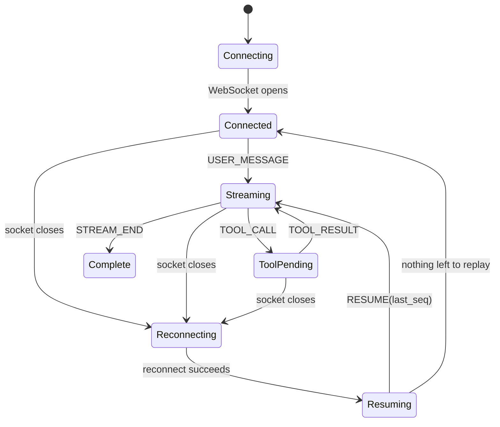

# Agent Console

This project is my submission for the Alchemyst Full Stack AI internship assignment.

I built the client around the idea that the network is unreliable by default. Instead of rendering packets immediately, every incoming packet first goes through a small sequencing buffer that handles duplicates and out-of-order delivery before anything reaches the UI. The UI itself is driven almost entirely from streamed events so the timeline, tool panel and context inspector all stay in sync with what the agent is actually doing.

1. Start the mock agent server
cd agent-server
npm install
npm run build
npm start

or

npm start -- --mode chaos

to enable chaos mode.

The server listens on:

ws://localhost:4747/ws

2. Start the client
npm install
npm run build
npm run start

or during development

npm run dev

Open

http://localhost:3000

## Connection State Machine

Complete --> Connected
